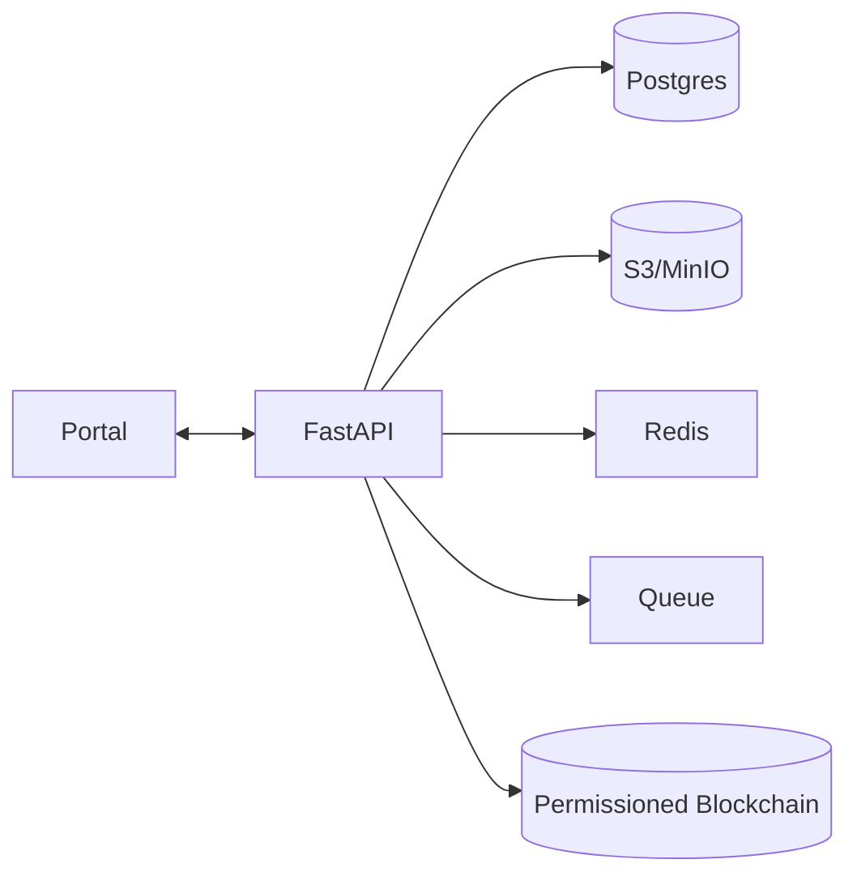

# DNA Platform (Monorepo)

An open, collaborative DNA research platform that lets researchers and citizen scientists **create, test, and evolve theories** using small family datasets — scaling to large cohorts with **diff-based storage**, **Bayesian updates**, and **privacy by design**.

👉 **Full technical blueprint:** [`docs/blueprint.md`](docs/blueprint.md)

## Architecture

