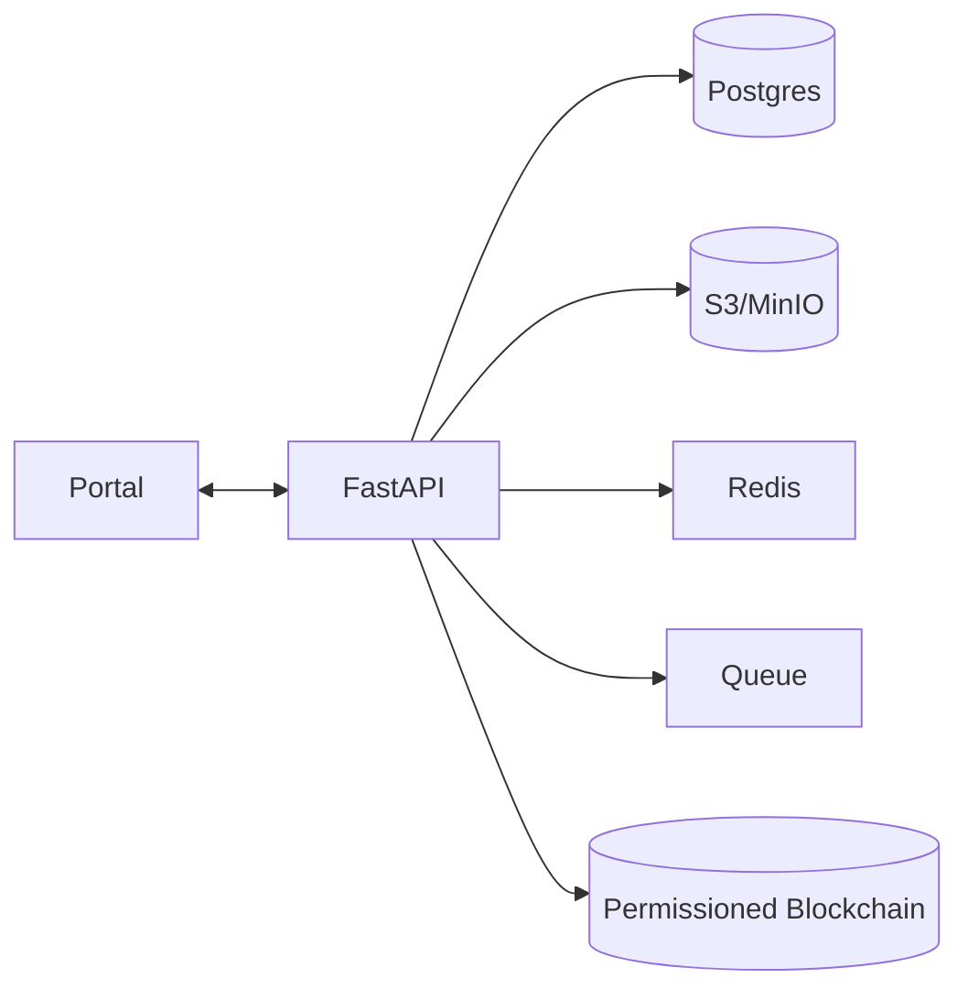

# DNA Research Platform (Monorepo)

[](https://opensource.org/licenses/MIT)
[](https://www.python.org/downloads/)
[](https://fastapi.tiangolo.com)

An open, collaborative DNA research platform that lets researchers and citizen scientists **create, test, and evolve theories** using small family datasets — scaling to large cohorts with **diff-based storage**, **Bayesian updates**, and **privacy by design**.

## 🚀 Quick Start

```bash
# Clone the repository
git clone https://github.com/YOUR_USERNAME/dnaresearch.git
cd dnaresearch

# Run with Docker
docker-compose -f docker/docker-compose.yml up

# Access the platform
# Portal: http://localhost:8080
# API: http://localhost:8000/docs
```

## 🎯 Mission

Deliver a reproducible, privacy-preserving, and cost-efficient genomics platform that makes **small family datasets** useful while scaling to cohorts.

### Core Innovations
1. **Theories-as-code (JSON)** with transparent priors/likelihoods and versioning
2. **Evidence accumulation** through Bayesian updating from families/cohorts
3. **Anchor+Diff storage** to minimize DB size and accelerate queries
4. **Dual UX** (parent-friendly summaries + researcher detail)
5. **Consent-aware** analysis with immutable audit trails

## 📋 Current Status

**MVP Phase** (Weeks 1-4):
- ✅ Basic API structure with health and gene search endpoints
- ✅ Docker containerization setup
- ✅ Project documentation and blueprint
- 🔄 JSON schemas and validators (in progress)
- 🔄 Anchor/Diff storage library (planned)

## 🏗️ Architecture



## 📚 Documentation

- 📖 **[Documentation Index](docs/README.md)** - Complete documentation overview
- 🚀 **[Getting Started](docs/user/getting-started.md)** - Quick setup guide
- 🛠️ **[Developer Setup](docs/developer/setup.md)** - Development environment
- 🏗️ **[Architecture Overview](docs/architecture/overview.md)** - System design
- 📋 **[Technical Blueprint](docs/architecture/technical-blueprint.md)** - Implementation guide
- 🤝 **[Contributing Guide](docs/developer/contributing.md)** - How to contribute
- 🔧 **[Troubleshooting](docs/troubleshooting/common-issues.md)** - Problem solving
- 🧪 **[Testing Strategy](docs/testing/testing-strategy.md)** - Quality assurance

## 🛣️ Roadmap

### Sprint 1-2 (Weeks 1-4) - MVP Core
- JSON schemas + validators
- Anchor/Diff storage library
- Gene lookup and interpretation
- Basic theory runner

### Sprint 3-4 (Weeks 5-8) - Integrations
- Sequencing partner webhooks
- Theory engine with Bayesian updates
- Redis caching
- Permissioned blockchain ledger

### Sprint 5-6 (Weeks 9-12) - Hardening
- Security review and hardening
- Monitoring and alerting
- Backup and disaster recovery
- UI/UX polish

## 🔒 Privacy & Ethics

This platform is built with **privacy by design**:
- GDPR compliance
- Consent-aware data processing
- Encrypted storage (AES-256)
- Immutable audit trails
- Right-to-be-forgotten support

## 💡 Innovation

This project contains novel approaches for genomic research:
- Multi-level anchored differentials for genomic storage
- Consent-aware genomic access via blockchain
- Iterative hypothesis testing engine (theories-as-code)

## 🤝 Contributing

We welcome contributions! Please read our [Contributing Guide](docs/developer/contributing.md) and check out our [roadmap](docs/architecture/technical-blueprint.md#13-roadmap).

## 📄 License

MIT License - see [LICENSE](LICENSE) file for details.