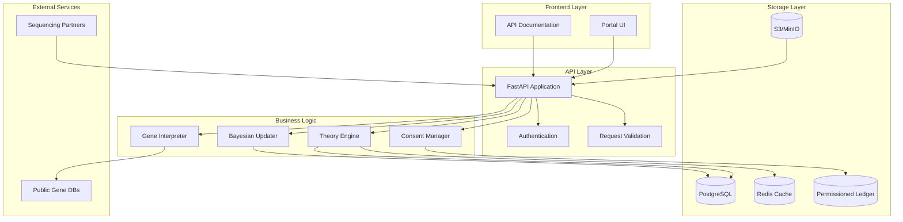

# Architecture Overview

## System Architecture

## Core Components

### API Layer (FastAPI)
- RESTful API with OpenAPI documentation
- Request validation and serialization
- Authentication and authorization
- Rate limiting and security headers

### Theory Engine
- JSON-based theory definitions
- Version management (SemVer)
- Theory forking and inheritance
- Dependency tracking

### Bayesian Updater
- Evidence accumulation from families/cohorts
- Posterior probability calculations
- Support classification (Weak/Moderate/Strong)
- Federated computation support

### Storage Strategy
- **Anchor+Diff**: Hierarchical genomic storage
- **PostgreSQL**: Metadata, theories, evidence
- **S3/MinIO**: Genomic files, encrypted artifacts
- **Redis**: Caching and session management
- **Blockchain**: Consent and audit trails

### Privacy & Security
- Encryption at rest (AES-256)
- Consent-aware data access
- Immutable audit logging
- GDPR compliance features

## Data Flow

1. **Theory Creation**: Researcher defines JSON theory
2. **Evidence Ingestion**: Genomic data from sequencing partners
3. **Bayesian Update**: Evidence updates theory posteriors
4. **Result Generation**: Reports for families and researchers
5. **Audit Trail**: All actions logged to blockchain

## Scalability Considerations
- Horizontal scaling via containerization
- Database sharding for large cohorts
- CDN for static assets
- Queue-based processing for heavy computations

## Security Architecture
- Zero-trust network model
- End-to-end encryption
- Role-based access control (RBAC)
- Attribute-based access control (ABAC)
- Regular security audits